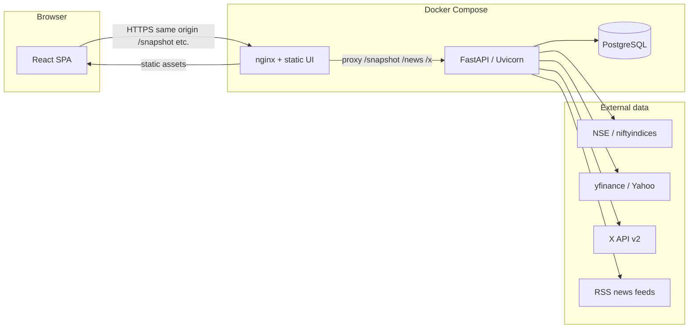
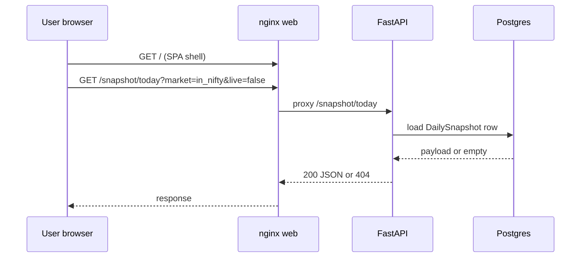

<!-- 
  Confluence: paste via Insert → Markup, or use a Markdown macro / HTML macro if your space enables it.
  Mermaid: enable "Mermaid Diagrams" app or paste diagrams into draw.io / Whimsical equivalents.
-->

# Market Snapshot Dashboard — Developer handbook (backend & frontend)

**Audience:** Engineers onboarding to the HeatMapDashboard / Market Snapshot codebase.  
**Scope:** Architecture, request flows, module map, extension points, and how UI talks to API.

---

## 1. Product overview

The system delivers a **daily (or on-demand) market snapshot** as structured JSON: India **Nifty 50** breadth and levels, **India VIX**, **FII/DII**, index **options** (PCR, OI walls), **global/commodity cues**, optional **X (Twitter) List** sentiment (FinBERT), and a **composite 0–100 sentiment** score. **US** variants cover broad US index / NASDAQ-style strips.

**Persistence:** PostgreSQL stores full snapshot payloads per **date** and **market**, plus headline columns for history queries.

**Delivery:** A **React** SPA reads snapshots via REST; **nginx** in Docker proxies API paths to **FastAPI**.

---

## 2. High-level system architecture



**Production (optional):** A host reverse proxy (e.g. **Caddy**) terminates TLS on **443** and forwards to Docker **`web`** on **8080**. See `docs/deployment-full-guide.md`.

---

## 3. Repository layout (logical)

| Area | Path | Role |
|------|------|------|
| Backend app | `backend/app/` | FastAPI app, routers, services, jobs, models |
| Backend migrations | `backend/alembic/` | Schema migrations |
| Frontend | `frontend/src/` | React UI |
| Infra | `docker-compose.yml`, `frontend/nginx.conf` | Multi-container runtime |
| Env | `.env.example`, root `.env` (gitignored) | Secrets and tuning |

---

# Part A — Backend

## A.1 Technology stack

| Layer | Choice |
|-------|--------|
| HTTP API | **FastAPI** |
| Server | **Uvicorn** (`backend/Dockerfile` CMD) |
| ORM / DB | **SQLAlchemy 2.x**, **PostgreSQL** (`JSONB` for snapshot payload) |
| Config | **Pydantic Settings** (`app/config.py`) — env vars + `.env` |
| Scheduling | **APScheduler** (`BackgroundScheduler`), cron in **Asia/Kolkata** |
| Migrations | **Alembic** (runs on container boot) |

## A.2 Application entrypoint

| File | Responsibility |
|------|----------------|
| `app/main.py` | Builds FastAPI app; registers **CORS** from `API_CORS_ORIGINS`; mounts routers; **`lifespan`** starts APScheduler jobs |

**Scheduler jobs:**

- **Daily snapshot:** `run_snapshot_pipeline(persist=True)` at `SNAPSHOT_CRON_HOUR` / `SNAPSHOT_CRON_MINUTE` (IST); default market pipeline focuses India (`in_nifty`) unless you extend the job.
- **Optional intraday:** If `INTRADAY_REFRESH_MINUTES > 0`, same pipeline on an interval.

Implementation: `app/jobs/snapshot_job.py` → calls `build_snapshot` / US builders → `upsert_daily_snapshot` (+ FII/DII upsert for India).

## A.3 HTTP routers (API surface)

All routes are included in `create_app()` without a global `/api` prefix (paths are absolute from root).

| Prefix | Router file | Purpose |
|--------|-------------|---------|
| `/snapshot` | `routers/snapshot.py` | Core snapshot CRUD-style operations |
| `/sentiment` | `routers/sentiment.py` | X sentiment drill-down |
| `/x` | `routers/x_sync.py` | X-only sync; optional persist patch to latest stored row |
| `/news` | `routers/news.py` | RSS-backed headlines per market |

**Snapshot routes (most important):**

| Method | Path | Behaviour |
|--------|------|-----------|
| GET | `/snapshot/today` | Query: `market`, `live`, `persist`. **`live=false`** (default): read **stored** row for **today IST**, else latest — returns **`payload`** or **404** `no_stored_snapshot`. **`live=true`**: rebuild from upstream (slow); optional **`persist=true`** saves. |
| GET | `/snapshot/history` | Recent rows with payload excerpts |
| POST | `/snapshot/refresh` | Manual rebuild + persist (scheduler-equivalent) |
| POST | `/snapshot/ingest` | Paste full snapshot JSON (e.g. from a machine where NSE works) |
| POST | `/snapshot/options/from-nse-json` | Merge **NSE option-chain JSON** into latest stored snapshot; recompute composite |

**Utility:**

| Method | Path | Purpose |
|--------|------|---------|
| GET | `/health` | Liveness + IST timestamp |
| GET | `/` | JSON index of useful paths |

Interactive docs: **`/docs`** (Swagger UI).

## A.4 Markets (`market` parameter)

Canonical IDs (see `VALID_MARKETS` in `routers/snapshot.py`):

| `market` | Builder entrypoint |
|----------|-------------------|
| `in_nifty` | `services/market_snapshot.build_snapshot` |
| `us_broad` | `services/us_market_snapshot.build_us_snapshot` |
| `usa_nasdaq` | `services/us_nasdaq_market_snapshot.build_us_nasdaq_snapshot` |

Adding a new market: implement a builder, register in router validation, extend frontend `MarketId` + `MARKETS`, and wire scheduler if needed.

## A.5 Snapshot build pipeline (India — conceptual)

`build_snapshot(settings)` in `services/market_snapshot.py` **orchestrates** specialist services:

1. **Index / breadth** — `index_service.fetch_nifty50_snapshot_resilient`
2. **Pivots / levels** — `technical_levels.build_pivot_from_yfinance_or_niftyindices`
3. **VIX** — `vix_service.fetch_india_vix`
4. **FII/DII** — `fii_dii_service.fetch_fii_dii`
5. **Nifty options** — `options_service.fetch_nifty_options_snapshot` (NSE chain); warnings if empty from datacenter IP
6. **Global strip** — `global_markets_service.fetch_global_cues` (yfinance; graceful degradation)
7. **X sentiment** — `x_sentiment_service.build_x_sentiment_report` (optional tokens; FinBERT)
8. **Composite** — `composite_sentiment.compute_composite` → **0–100** score + explanation

Output is one **dict** (`payload`) with stable sections: `header`, `index`, `vix`, `options`, `fii_dii`, `global_markets`, `composite`, `meta` (e.g. `data_warnings`), etc.

**Design intent:** Services are **mostly synchronous** HTTP/yfinance/NSE clients; long work is why nginx proxy timeouts are high for `/snapshot`.

## A.6 Composite sentiment

| File | Content |
|------|---------|
| `services/composite_sentiment.py` | Weights (index, VIX, PCR, FII, X), subscore mappers, `compute_composite(...)` |

Weights must sum to **1.0** (documented in file). Tuning the model = adjust constants + narrative in `narrative_service` if titles should change.

## A.7 Persistence

| Model | Table | Role |
|-------|-------|------|
| `DailySnapshot` | `daily_snapshots` | **Unique** `(snapshot_date, market_id)`; **`payload`** JSONB; headline floats for listing |
| `FiiDiiFlow` | `fii_dii_flows` | Normalized FII/DII series (India flows) |

Repository helpers: `repositories/snapshot_repo.py` (`upsert_daily_snapshot`, `get_snapshot_for_date`, `list_recent_snapshots`, …).

**DB session:** `db.py` — `get_db()` dependency for FastAPI routes.

## A.8 Configuration (`app/config.py`)

Settings load from **environment** (Docker passes `.env` via Compose). Notable fields:

- `DATABASE_URL` — overridden in Compose to point at **`db`** service
- `YFIN_*` — Yahoo symbols for indices, gold, crude, USD/INR, US indexes
- `XBEARER_TOKEN`, `X_LIST_ID` — optional X List sentiment
- `DATABENTO_*` — optional US options analytics path
- `SNAPSHOT_CRON_*`, `INTRADAY_REFRESH_MINUTES`
- `API_CORS_ORIGINS` — comma-separated browser origins

## A.9 Extension points (backend)

| Goal | Where to work |
|------|----------------|
| New data source for India snapshot | New or extended `services/*_service.py`; call from `market_snapshot.build_snapshot` |
| New market | New `build_*_snapshot`; wire `snapshot_job`, `snapshot_today` live branch, tests |
| New HTTP endpoint | New `routers/*.py` + `include_router` in `main.py` |
| Schema change | Alembic migration + model update |

---

# Part B — Frontend

## B.1 Technology stack

| Layer | Choice |
|-------|--------|
| Build | **Vite** + **TypeScript** |
| UI | **React 18**, **Tailwind CSS** |
| Routing | **react-router-dom** (`BrowserRouter`) |
| Data | **fetch** to same-origin paths (proxied to API) |

## B.2 Routes and pages

| URL | Component | Role |
|-----|------------|------|
| `/` | `pages/DashboardPage.tsx` | Main dashboard cards driven by snapshot JSON |
| `/admin` | `pages/AdminPage.tsx` | Live refresh, X sync, NSE JSON ingest helpers |
| `*` | Redirect to `/` | SPA fallback |

## B.3 Global market selection

| File | Role |
|------|------|
| `market/MarketContext.tsx` | React context: **`market`** ∈ `in_nifty` \| `us_broad` \| `usa_nasdaq`; persisted in **`localStorage`** (`MARKET_STORAGE_KEY`) |
| `market/types.ts` | `MARKETS` metadata (`snapshotReady`, labels) |

Changing market updates **`fetch`** query param `market=...` on all snapshot/news calls.

## B.4 How the UI reaches the API

**Development:** `vite.config.ts` **proxies** `/snapshot`, `/sentiment`, `/health`, `/news`, `/x` → `http://localhost:8000`.

**Production (Docker):** `frontend/nginx.conf` proxies the same path prefixes to **`http://api:8000`**. The browser only talks to the **same origin** as the SPA (no CORS for simple same-origin GETs from the page). The **API** still sets CORS for direct browser hits to port 8000 or external tools.

Timeouts are increased for `/snapshot` because upstream builds can exceed 60s.

## B.5 Dashboard data flow

1. **Initial state:** Optional cache from `snapshotStorage.ts` (`localStorage`, per-market key).
2. **Fetch:** `GET /snapshot/today?market=<id>&live=<true|false>`
   - Default **`live=false`**: fast path — **DB only**. If **404**, UI may show “run Admin refresh” or use `?live=1`.
   - **`live=true`** (`?live=1` in URL): expensive rebuild — **must not** be default for nginx timeouts in prod unless acceptable.
3. **Success:** Parse JSON as **`Snapshot`** (`types.ts`); **`persistSnapshot`** to localStorage for offline-ish resilience.

## B.6 Key UI modules

| File / dir | Role |
|------------|------|
| `components/ui/Card.tsx` | Layout primitive |
| `components/NewsSection.tsx` | `GET /news?market=...` |
| `pages/DashboardPage.tsx` | Composite meter, index, breadth, VIX, options, global, X block, Databento section when present |
| `pages/AdminPage.tsx` | Operational actions (live snapshot, X sync, paste NSE JSON) |
| `types.ts` | TypeScript shapes mirroring API payload |
| `snapshotStorage.ts` | Per-market local cache keys |

## B.7 Extension points (frontend)

| Goal | Where |
|------|--------|
| New card / section | `DashboardPage.tsx` — consume new payload fields (coordinate with backend JSON shape) |
| New market in UI | `market/types.ts` + ensure backend `market` id matches |
| New admin tool | `AdminPage.tsx` + new `fetch` to added endpoint |

---

# Part C — Cross-cutting concerns

## C.1 End-to-end: “User opens dashboard”



## C.2 End-to-end: “Daily job persists snapshot”

APScheduler → `run_snapshot_pipeline` → builder → `upsert_daily_snapshot` → DB. No browser involved.

## C.3 Docker services (from `docker-compose.yml`)

| Service | Image / build | Ports (host) |
|---------|----------------|--------------|
| `db` | `postgres:16-alpine` | 5432 (restrict in prod) |
| `api` | `backend/Dockerfile` | 8000 |
| `web` | `frontend/Dockerfile` (nginx) | 8080 → 80 |

Compose sets `DATABASE_URL` for `api` to the **`db`** hostname. **`API_CORS_ORIGINS`** should be passed via `.env` using `${API_CORS_ORIGINS:-...}` pattern.

## C.4 Operational pitfalls (for developers)

- **NSE / options empty** from non-India IPs — documented warnings in payload `meta.data_warnings`.
- **`live=true`** on `/snapshot/today` — heavy; default dashboard uses **stored** rows.
- **502 behind Caddy** — usually **`web`** container down; **`curl 127.0.0.1:8080`** on host.

---

# Part D — Related documentation

| Document | Content |
|----------|---------|
| `README.md` | Run locally, Docker, env var table |
| `Run.md` | Docker ports and commands |
| `docs/deployment-full-guide.md` | VPS, DNS, firewall, Caddy, CORS, troubleshooting |
| `backend/app/services/composite_sentiment.py` | Composite scoring math |

---

## Appendix — Quick API reference (copy-friendly)

```
GET  /health
GET  /snapshot/today?market=in_nifty|us_broad|usa_nasdaq&live=false|true&persist=false|true
GET  /snapshot/history?days=30
POST /snapshot/refresh?market=...
POST /snapshot/ingest?market=...&persist=true
POST /snapshot/options/from-nse-json?market=...&symbol=NIFTY&persist=true
GET  /sentiment/x
GET  /news?market=...&limit=12
POST /x/sync?...
```

---

*End of handbook. Update this file when architecture or routes change; keep Confluence in sync or link to this file in Git.*
